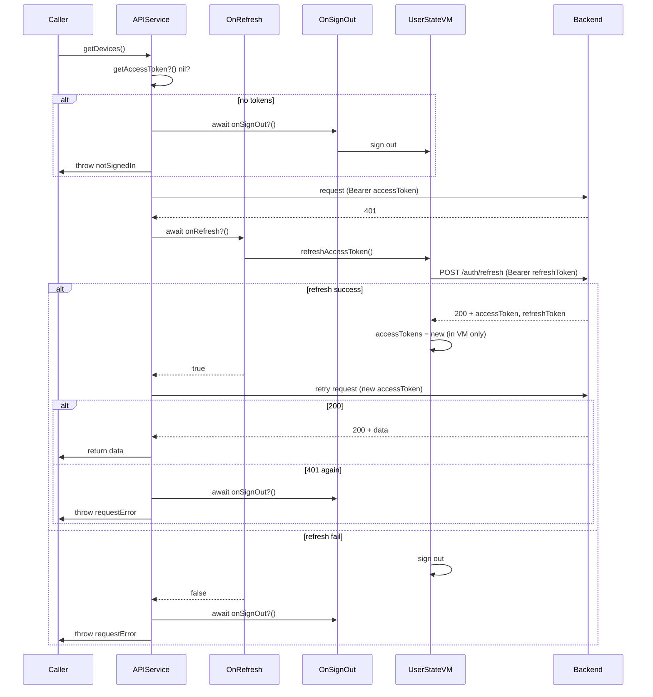

# Token refresh and authentication flow

## Current state

- **Backend**: `POST /auth/refresh` with `Authorization: Bearer &lt;refreshToken&gt;` returns `{ accessToken, refreshToken }` ([auth.controller.ts](backend/src/auth/auth.controller.ts), [jwt-refresh.strategy](backend/src/auth/strategies/jwt-refresh.strategy.ts)).
- **UserStateViewModel** ([UserStateViewModel.swift](mobile_ios/OinkBrew Mobile/ViewModels/UserStateViewModel.swift)): owns `isSignedIn`; currently writes tokens to `Preferences.shared.accessTokens`. **Change**: tokens will be stored only in UserStateViewModel (in-memory), not in Preferences. No refresh method yet.
- **APIService** ([ApiServices.swift](mobile_ios/OinkBrew Mobile/Services/ApiServices.swift)): struct with no dependencies; each method builds its own request, uses `preferences.accessTokens`. **Change**: APIService will get the current access token via a callback (e.g. `getAccessToken`) provided by the app (from UserStateViewModel), not from Preferences. **Bug**: `getConfigurations()` uses `Bearer \(accessTokens)` instead of `Bearer \(accessTokens.accessToken)` (line 28).
- **Call sites**: [DevicesViewModel](mobile_ios/OinkBrew Mobile/ViewModels/DevicesViewModel.swift) and [ConfigurationsViewModel](mobile_ios/OinkBrew Mobile/ViewModels/ConfigurationsViewModel.swift) use `APIService().getDevices()` / `getConfigurations()` / `updateDevice(...)` with no shared instance or callbacks.

## Architecture: how APIService triggers sign-out and refresh

APIService currently has no reference to `UserStateViewModel`. To keep a single place for "refresh" and "sign out" and avoid passing view models through many layers:

- Introduce **optional callbacks** on APIService: `getAccessToken: (() -> String?)?` (to build authenticated requests; source of truth is UserStateViewModel), `onRefresh: (() async -> Bool)?`, and `onSignOut: (() async -> Void)?`.
- Use a **shared APIService instance** configured at app launch with closures that call into `UserStateViewModel`: `getAccessToken` returns the view model's current access token; `onRefresh` / `onSignOut` call the view model's refresh and sign-out. View models and call sites will use this shared instance instead of `APIService()`.

Because `UserStateViewModel` is `@MainActor`, the closures should dispatch to the main actor when calling it (e.g. `await MainActor.run { … }` inside the closure).

---

## 1. UserStateViewModel: store tokens only here; add refresh

**File**: [UserStateViewModel.swift](mobile_ios/OinkBrew Mobile/ViewModels/UserStateViewModel.swift)

- **Token storage**: Store tokens only in UserStateViewModel. Add a private property (e.g. `private var accessTokens: AccessTokens?`) as the single source of truth. Remove all reads/writes of `preferences.accessTokens` from UserStateViewModel. In `signInOtp` and `signUpOtp` on success, set `self.accessTokens = try JSONDecoder()...` instead of `preferences.accessTokens = ...`. In `signOut()` and on refresh failure, clear `self.accessTokens = nil` (and do not write to Preferences). Expose the current access token for API requests via a method or read-only property (e.g. `var currentAccessToken: String? { accessTokens?.accessToken }`) so the app can pass a `getAccessToken` closure to APIService that returns this value.
- **Refresh method**: Add `refreshAccessToken() async -> Result<Bool, UserStateError>`.
  - If `self.accessTokens` is nil or `refreshToken` is missing, call `performSignOut()` and return failure.
  - Build request: `POST \(preferences.correctedApiUrl())/auth/refresh` with `Authorization: Bearer \(refreshToken)`.
  - On HTTP 200: decode response as `AccessTokens`, set `self.accessTokens = decoded` (only in the view model; do not update Preferences), return success.
  - On any other response or throw: call `performSignOut()` and return failure.
- Extract a private `performSignOut()` that clears `accessTokens`, `signupTokens`, `signinTokens`, and sets `isSignedIn = false`. Use it from `signOut()`, refresh failure, and (if needed) from the public sign-out path.

---

## 2. APIService: sign out on `APIError.notSignedIn`

**File**: [ApiServices.swift](mobile_ios/OinkBrew Mobile/Services/ApiServices.swift)

- Before throwing `APIError.notSignedIn` (in `getConfigurations`, `getDevices`, `updateDevice`), call `await onSignOut?()` (if non-nil), then throw.
- This requires APIService to hold an optional `onSignOut: (() async -> Void)?` and to be invoked in an async context. Callbacks can be set on a shared instance (see below).

---

## 3. APIService: retry once on 401 with new access token

- When a request returns **HTTP 401**:
  - Call `await onRefresh?()` (or equivalent) to get a new access token and persist it (via UserStateViewModel's new method). If `onRefresh?()` returns false or is nil, treat as refresh failed.
  - If refresh succeeded: rebuild the **same** request using the updated `preferences.accessTokens.accessToken` and retry **once**.
  - If the **retry** still returns 401: do **not** retry again; proceed to step 4 (sign out and return error).
- To avoid duplicating "build request → perform request → handle 401 + retry" in every method, introduce an internal helper, e.g. `performAuthenticatedRequest<T>(buildingRequest: (String) -> URLRequest, parseResponse: (Data, HTTPURLResponse) throws -> T) async throws -> T`. It would:
  - Get the current access token via `getAccessToken?()` (from UserStateViewModel); if nil, call `onSignOut?()` and throw `APIError.notSignedIn`.
  - Build the request with that token, perform it.
  - If response is 401 and a 401-retry has not been done yet: call `onRefresh?()`; if success, get the token again via `getAccessToken?()`, rebuild request with the new token and retry once; if second response is 401, go to step 4.
  - If response is success, parse and return; if other error, throw appropriately.
- Then `getConfigurations`, `getDevices`, and `updateDevice` would use this helper (or a variant that fits their request/response shapes) so 401 handling and retry are in one place.

---

## 4. APIService: second 401 → sign out and return `APIError.requestError`

- When the **second** attempt (after one refresh) still returns 401:
  - Call `await onSignOut?()`.
  - Throw `APIError.requestError` (as specified).
- This keeps the "max one refresh per logical request" and a single place for "sign out + throw".

---

## 5. Reset 401-retry state

- Maintain a **per-request or per-call** notion of "has we already tried refresh for this request?" so that:
  - **First** 401 → refresh and retry once.
  - **Second** 401 → sign out and throw `APIError.requestError`.
- Reset this "already retried" flag:
  - When the request **succeeds** (so the next API call can again do one refresh on 401).
  - When we **return** after the second 401 (sign out and throw), so the next call starts with a clean state.
- So the counter/flag is not global across all requests; it's "for this logical request, have we already done one refresh?" — i.e. reset on success or when we throw after the second 401. Implementation can be a local `var didRetry401 = false` inside the helper used for a single call.

---

## Implementation steps (build order)

Each step is buildable on its own; dependencies are only on previous steps.

| Step  | Description                                                  | Depends on |
| ----- | ------------------------------------------------------------ | ---------- |
| **1** | UserStateViewModel: token storage in VM only ✅               | —          |
| **2** | UserStateViewModel: refresh method                           | 1          |
| **3** | APIService: shared instance and callback properties          | —          |
| **4** | App: wire shared APIService to UserStateViewModel            | 1, 2, 3    |
| **5** | APIService: use getAccessToken; onSignOut before notSignedIn | 3, 4       |
| **6** | APIService: authenticated-request helper with 401 retry      | 5          |
| **7** | APIService: refactor endpoints to use helper                 | 6          |
| **8** | Call sites: use APIService.shared                            | 4          |
| **9** | Preferences: remove accessTokens                             | 5          |

---

### Step 1 – UserStateViewModel: token storage in VM only ✅ Done

**Depends on:** none.

**File:** [UserStateViewModel.swift](mobile_ios/OinkBrew Mobile/ViewModels/UserStateViewModel.swift)

- Add `private var accessTokens: AccessTokens?` as the single source of truth for tokens.
- Expose `var currentAccessToken: String? { accessTokens?.accessToken }` (or equivalent) for the app to pass to APIService later.
- In `signInOtp` and `signUpOtp` on success: set `self.accessTokens = try JSONDecoder().decode(AccessTokens.self, from: data)` instead of `preferences.accessTokens = ...`.
- Extract a private `performSignOut()` that sets `accessTokens = nil`, `signupTokens = nil`, `signinTokens = nil`, and `isSignedIn = false`.
- In `signOut()`: call `performSignOut()` instead of manually clearing; remove write to `preferences.accessTokens`.
- Remove all other reads/writes of `preferences.accessTokens` from UserStateViewModel.

**Verification:** Sign-in/sign-up OTP still signs in; sign-out still clears state; tokens live only in the view model.

---

### Step 2 – UserStateViewModel: refresh method

**Depends on:** Step 1.

**File:** [UserStateViewModel.swift](mobile_ios/OinkBrew Mobile/ViewModels/UserStateViewModel.swift)

- Add `refreshAccessToken() async -> Result<Bool, UserStateError>`.
  - If `self.accessTokens` is nil or `refreshToken` is missing: call `performSignOut()` and return `.failure(.signOutError)` (or appropriate error).
  - Build `POST \(preferences.correctedApiUrl())/auth/refresh` with `Authorization: Bearer \(refreshToken)`.
  - On HTTP 200: decode body as `AccessTokens`, set `self.accessTokens = decoded`, return `.success(true)`.
  - On any other response or thrown error: call `performSignOut()` and return `.failure(...)`.
- Use the same `URLSession` (e.g. `session`) as other auth calls.

**Verification:** With valid refresh token, calling refresh returns success and updates `accessTokens`; with invalid/missing token, returns failure and performs sign-out.

---

### Step 3 – APIService: shared instance and callback properties

**Depends on:** none.

**File:** [ApiServices.swift](mobile_ios/OinkBrew Mobile/Services/ApiServices.swift)

- Add optional callback properties: `var getAccessToken: (() -> String?)?`, `var onRefresh: (() async -> Bool)?`, `var onSignOut: (() async -> Void)?`.
- Provide a shared instance: e.g. `static let shared = APIService()` (if APIService remains a struct, use a class wrapper that holds the struct and these properties so they can be mutated; or make APIService a class with `static let shared = APIService()`).
- Fix existing bug in `getConfigurations()`: set Authorization header to `Bearer \(accessTokens.accessToken)` (not `accessTokens`). Leave the rest of the methods still using `preferences.accessTokens` for now.

**Verification:** Compiles; `APIService.shared` exists and has the three optional callbacks; getConfigurations sends the correct Bearer token where `accessTokens` is present.

---

### Step 4 – App: wire shared APIService to UserStateViewModel

**Depends on:** Steps 1, 2, 3.

**File:** [OinkBrew_MobileApp.swift](mobile_ios/OinkBrew Mobile/OinkBrew_MobileApp.swift)

- After creating `userStateViewModel`, set on the shared APIService:
  - `getAccessToken = { ... }` — return `userStateViewModel.currentAccessToken` (closure must run on MainActor or capture in a way that is safe when called from async API code).
  - `onRefresh = { await MainActor.run { await userStateViewModel.refreshAccessToken() } ... }` — call refresh and return `true`/`false` from the Result.
  - `onSignOut = { await MainActor.run { _ = await userStateViewModel.signOut() } }` (or equivalent that clears signed-in state).
- Ensure closures capture `userStateViewModel` so the shared APIService uses the same view model as the app.

**Verification:** App launches without crash; shared APIService has non-nil callbacks that reference the view model.

---

### Step 5 – APIService: use getAccessToken; onSignOut before notSignedIn

**Depends on:** Steps 3, 4.

**File:** [ApiServices.swift](mobile_ios/OinkBrew Mobile/Services/ApiServices.swift)

- In `getConfigurations`, `getDevices`, and `updateDevice`: obtain the access token via `getAccessToken?()`. If nil, call `await onSignOut?()` then throw `APIError.notSignedIn`. Use the returned string for the `Authorization: Bearer ...` header.
- Remove all use of `preferences.accessTokens` from APIService (replace with the token from `getAccessToken?()`).

**Verification:** When no token (e.g. not signed in), API calls trigger onSignOut and throw notSignedIn; when signed in (tokens in UserStateViewModel), requests use the token from the callback. Preferences no longer read for tokens in APIService.

---

### Step 6 – APIService: authenticated-request helper with 401 retry

**Depends on:** Step 5.

**File:** [ApiServices.swift](mobile_ios/OinkBrew Mobile/Services/ApiServices.swift)

- Add an internal helper, e.g. `performAuthenticatedRequest<T>(buildingRequest: (String) -> URLRequest, parseResponse: (Data, HTTPURLResponse) throws -> T) async throws -> T`.
  - Get token via `getAccessToken?()`. If nil, `await onSignOut?()`, throw `APIError.notSignedIn`.
  - Build request with that token, perform it with `URLSession.shared.data(for: request)`.
  - If status is 401 and this request has not yet retried: call `await onRefresh?()`. If refresh returns true, get token again via `getAccessToken?()`, rebuild request, perform again. If that second response is 401: `await onSignOut?()`, throw `APIError.requestError`. If refresh returns false or nil: `await onSignOut?()`, throw `APIError.requestError`.
  - If response is success (e.g. 2xx): call `parseResponse(data, httpResponse)` and return. Otherwise throw an appropriate error (e.g. statusNotOk, decodingError).
  - Use a local `var didRetry401 = false` inside the helper so the "already retried" state resets for each new call (and is effectively reset after success or after throwing requestError).
- Do not refactor the existing methods to use this helper yet; only add the helper.

**Verification:** Helper compiles and implements the above logic; existing methods still work as after Step 5.

---

### Step 7 – APIService: refactor endpoints to use helper

**Depends on:** Step 6.

**File:** [ApiServices.swift](mobile_ios/OinkBrew Mobile/Services/ApiServices.swift)

- Refactor `getConfigurations()` to use `performAuthenticatedRequest`: build request in a closure that takes the token string; parse response in a closure that decodes `[BeerConfiguration]`.
- Refactor `getDevices()` similarly (include date decoder in parse closure if needed).
- Refactor `updateDevice(...)` similarly (parse closure can return `Void` or a simple success type).
- Remove duplicated 401/token logic from the three methods.

**Verification:** getConfigurations, getDevices, updateDevice behave as before but go through the helper; first 401 triggers refresh and retry; second 401 triggers sign-out and requestError.

---

### Step 8 – Call sites: use APIService.shared

**Depends on:** Step 4.

**Files:** [DevicesViewModel.swift](mobile_ios/OinkBrew Mobile/ViewModels/DevicesViewModel.swift), [ConfigurationsViewModel.swift](mobile_ios/OinkBrew Mobile/ViewModels/ConfigurationsViewModel.swift)

- Replace `APIService()` with `APIService.shared` (or the shared wrapper type) wherever getDevices, getConfigurations, or updateDevice are called.

**Verification:** Devices and configurations screens still load and update; they use the shared instance that has callbacks configured.

---

### Step 9 – Preferences: remove accessTokens

**Depends on:** Step 5 (no remaining readers in APIService or UserStateViewModel).

**File:** [Preferences.swift](mobile_ios/OinkBrew Mobile Tests/ViewModels/Preferences.swift) (and any other definition of `Preferences` used by the app)

- Remove the `accessTokens` property from Preferences, or leave it unused and document that token storage is in UserStateViewModel only.
- If any test or other code still references `preferences.accessTokens`, update it to use UserStateViewModel or the shared APIService as appropriate.

**Verification:** App and tests compile; no references to `preferences.accessTokens`; token flow is entirely via UserStateViewModel and APIService callbacks.

---

### Flow summary

---

## Files to touch (by step)

| File                                                                                                 | Steps                                                                                                 |
| ---------------------------------------------------------------------------------------------------- | ----------------------------------------------------------------------------------------------------- |
| [UserStateViewModel.swift](mobile_ios/OinkBrew Mobile/ViewModels/UserStateViewModel.swift)           | 1 (token storage, performSignOut, currentAccessToken), 2 (refreshAccessToken)                         |
| [ApiServices.swift](mobile_ios/OinkBrew Mobile/Services/ApiServices.swift)                           | 3 (shared + callbacks, Bearer fix), 5 (getAccessToken, onSignOut), 6 (helper), 7 (refactor to helper) |
| [OinkBrew_MobileApp.swift](mobile_ios/OinkBrew Mobile/OinkBrew_MobileApp.swift)                      | 4 (wire callbacks)                                                                                    |
| [DevicesViewModel.swift](mobile_ios/OinkBrew Mobile/ViewModels/DevicesViewModel.swift)               | 8 (use shared)                                                                                        |
| [ConfigurationsViewModel.swift](mobile_ios/OinkBrew Mobile/ViewModels/ConfigurationsViewModel.swift) | 8 (use shared)                                                                                        |
| [Preferences.swift](mobile_ios/OinkBrew Mobile Tests/ViewModels/Preferences.swift)                   | 9 (remove accessTokens)                                                                               |

Tests in [UserStateViewModelTests](mobile_ios/OinkBrew Mobile Tests/ViewModels/UserStateViewModelTests.swift) and any APIService tests should be updated or extended to cover refresh and the new callback behavior (after the steps that introduce them).
